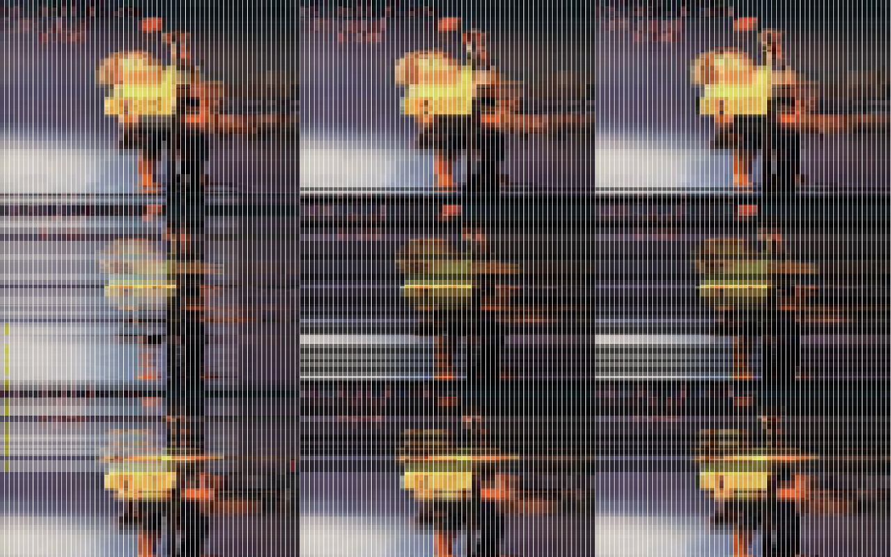
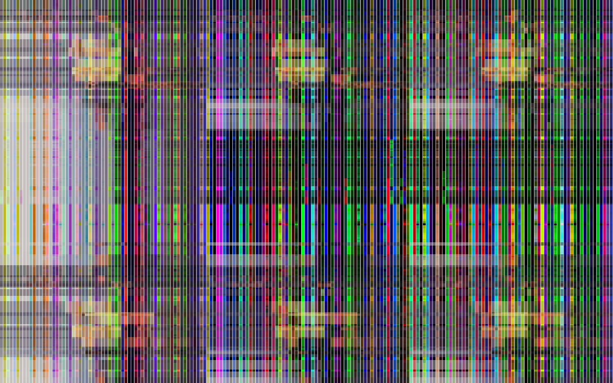

#girl25

a glitch synthetic av art piece by André Sier celebrating 40 years of 25th April 1974. 

iconic image of a girl placing a carnation on a soldiers' gun is evolved using genetic algorithms on the image's rgb channels.

sound is synthesized from current rgb scanline values.

built 24th april 2014, from 22h to 23h, 1h speed project, celebrating no freedom in pt & around the world with a free opensource art work..

running on a raspberry pi at Laboratório Galeria's collective exhibition "Apeados, não há nada para ninguém", april-may 2014.

### how to build

download this repository

download [openframeworks](https://github.com/openframeworks/openFrameworks) 007+

download [ofxDna](https://github.com/s373/ofxDna)

copy ofxDna to openframeworks/addons folder

run openframeworks project generator 

name your project, add addon ofxDna, copy src to generated project's source and copy image do your project's data folder

open project, compile, run, enjoy!

(included in the repository is an osx build)

### license / copyright
girl25 copyright © André Sier, 2014

code released under [GPL v3](https://www.gnu.org/copyleft/gpl.html) license

### screenshots

